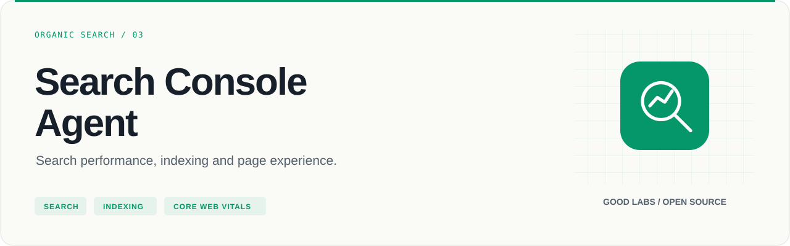
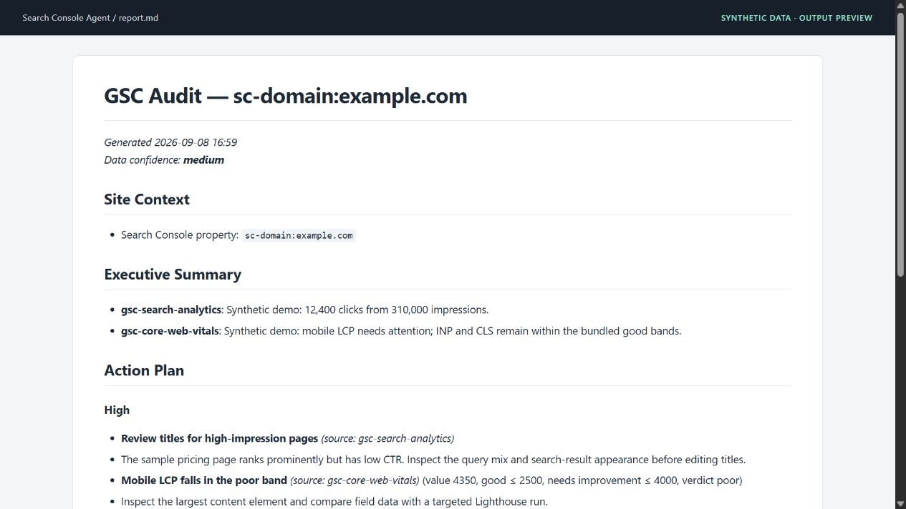

<p align="center">
  
</p>

# Search Console Agent

Search performance, indexing and page experience.

[](https://github.com/arcbaslow/google-search-console-agent/actions/workflows/tests.yml)
[](https://github.com/arcbaslow/google-search-console-agent/releases)
[](#installation)
[](LICENSE)

[Quick start](#quick-start) · [Example output](#example-output) · [Tests](#tests) · [Releases](#releases) · [Contributing](CONTRIBUTING.md)

A Python toolkit for Search Console analysis, with adapters for Search Analytics, URL Inspection, sitemaps, Chrome UX Report and PageSpeed Insights. Run a complete audit or retrieve one specific report as JSON.

## What you can do

| Area | Included capabilities |
| --- | --- |
| Search performance | Queries, pages, countries, devices, search appearance and time series |
| CTR diagnosis | Compare observed CTR with the bundled position-based reference curve |
| Indexing | Inspect a URL's indexed state and canonical; review sitemap errors |
| Performance | CrUX field data and history; PageSpeed Insights lab diagnostics |
| Site checks | JSON-LD validation, optional HTTP-header, TLS and external page-experience checks |
| Domain context | Optional Tranco and Open PageRank lookups; these are domain proxies, not a backlink index |
| Reporting | Prioritized Markdown audits, HTML and optional PDF |

## Installation

Requires **Python 3.10+**. Live Google API calls require access to the relevant Search Console property and Google Cloud SDK for the default sign-in path.

```bash
git clone https://github.com/arcbaslow/google-search-console-agent.git
cd google-search-console-agent
python -m venv .venv
```

Activate with `source .venv/bin/activate` on macOS/Linux or `.venv\Scripts\Activate.ps1` in Windows PowerShell, then:

```bash
python -m pip install -e ".[dev]"
```

PDF export is optional: install `.[pdf]` and the WeasyPrint runtime libraries described in [setup](docs/SETUP.md). Markdown and HTML work without that extra.

## Quick start

```bash
python scripts/gsc_auth.py --adc
# Run the printed gcloud command, then:
python scripts/gsc_auth.py --check
python scripts/gsc_auth.py --sites
python scripts/gsc_auth.py --quota-project YOUR_CLOUD_PROJECT_ID
```

Enable the APIs you intend to use in the quota project. Replace `example.com` with an accessible property:

```bash
python scripts/gsc_audit.py --site example.com --days 28 --output audit.md
python scripts/gsc_data.py --site example.com --queries --days 28 --rows 100 --json
```

| Input | Interpreted as |
| --- | --- |
| `example.com` | `sc-domain:example.com` |
| `sc-domain:example.com` | Domain property, unchanged |
| `https://example.com/` | URL-prefix property, unchanged |

The OAuth desktop-client fallback is `gsc_auth.py --oauth --client-secret-file client.json`.

## Example output



The screenshot is the actual Markdown report rendered for documentation, using **synthetic data**. Reproduce it without Google credentials or external requests:

```bash
python scripts/gsc_report.py --site sc-domain:example.com --inputs examples/demo/search.json,examples/demo/cwv.json --format md --output audit.md
```

Read the [generated report](examples/demo/report.md), [input fixtures](examples/demo/) or the longer, separately authored [sample audit](examples/sample-audit.md).

## Everyday commands

```bash
python scripts/gsc_data.py --site example.com --pages --days 28 --rows 100 --json
python scripts/gsc_data.py --site example.com --timeseries --days 90 --json
python scripts/gsc_admin.py --site example.com --list-sitemaps --json
python scripts/gsc_admin.py --site example.com --url https://example.com/pricing --inspect --json
python scripts/gsc_crux.py --origin https://example.com --form-factor PHONE --json
python scripts/gsc_psi.py --url https://example.com/pricing --strategy mobile --json
```

For optional domain and page-experience checks:

```bash
python scripts/gsc_audit.py --site example.com --with-backlinks --output audit.md
python scripts/gsc_audit.py --site example.com --with-page-experience --output audit.md
```

Open PageRank requires `OPENPAGERANK_API_KEY`; Tranco can run without it. Page-experience checks contact third-party services and can take longer than the main audit. URL inspection is intended for targeted checks, not unrestricted bulk crawling.

### Agent workflow

The [router](skills/gsc/SKILL.md) exposes `/gsc audit`, `/gsc queries`, `/gsc cwv`, `/gsc pagespeed`, `/gsc inspect` and other commands. The [Python command reference](AGENTS.md) lets other runtimes run the same adapters.

### Sitemap and site management

Sitemap submission/deletion and site add/delete require the `webmasters` write scope and suitable property permissions. Print the write-scope sign-in command with `python scripts/gsc_auth.py --adc --write`.

The agent instructions require review and confirmation. Direct `gsc_admin.py` write flags execute the API operation without an interactive prompt, so review the exact property and sitemap URL before calling them.

### Interpreting the results

The bundled CTR curve is a historical reference, not a prediction for every query or SERP. CrUX field data and Lighthouse lab results measure different conditions. Structured-data validation checks the implemented rules and cannot guarantee rich-result eligibility. Header and TLS diagnostics describe technical conditions; they do not prove a ranking effect.

The report defaults to `medium` confidence and drops to `low` when search-data retrieval fails. That label is an audit convention, not an estimate of Search Console sampling.

## Tests

```bash
python -m ruff check scripts/
python -m pytest scripts/ -q
```

CI runs on Python 3.10–3.13. Tests mock Google and external services and use temporary caches. Coverage includes auth, property normalization, query building, sitemap operations, audit orchestration, report rendering, benchmark comparisons, PII scrubbing and structured-data checks. Live sitemap writes are not part of this suite. See the [release verification](docs/VERIFICATION.md).

## Repository map

| Path | Purpose |
| --- | --- |
| [scripts/](scripts/) | API adapters, site checks, report rendering and tests |
| [agents/](agents/) · [skills/](skills/) | SEO specialists and `/gsc` routing |
| [examples/demo/](examples/demo/) | Synthetic inputs and a reproducible report |
| [docs/](docs/) | Setup, releases and verification |

## Releases

**[v0.2.2](https://github.com/arcbaslow/google-search-console-agent/releases/tag/v0.2.2)** — see the [release notes](docs/RELEASE_NOTES.md) for this release and the [changelog](CHANGELOG.md) for project history.

GitHub Releases include downloadable artifacts and checksums. Package-registry publication is a separate, opt-in workflow; a GitHub release does not imply that the same version is available on PyPI or npm. Maintainers can follow the [release guide](docs/RELEASING.md).

## Contributing

Read [CONTRIBUTING.md](CONTRIBUTING.md), run the checks above, and include a minimal reproduction for bugs. Report vulnerabilities through [SECURITY.md](SECURITY.md).

## Related tools

| Project | Use it for |
| --- | --- |
| [Google Ads Agents](https://github.com/arcbaslow/google-ads-agents) | Paid media audits, tracking checks and reviewed changes. |
| [Google Analytics Agent](https://github.com/arcbaslow/google-analytics-agent) | GA4 data quality, funnels and property management. |
| [Meta Ads Agents](https://github.com/arcbaslow/meta-ads-agents) | Campaign performance, creative fatigue and event health. |
| [GTM Diff](https://github.com/arcbaslow/gtm-diff) | Review the changes in your Google Tag Manager exports. |
| [Figma Taxonomy Gen](https://github.com/arcbaslow/figma-taxonomy-gen) | Turn interactive designs into a reviewable tracking plan. |

Maintained by [Good Labs](https://goodlabs.kz) — measurement implementation, tracking plans and analytics audits.

## License

[MIT](LICENSE) © Dilshat Rakhimov. This is an independent project; it is not an official product of the platform vendors.
